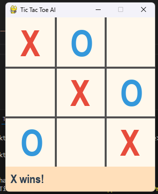

# Tic-Tac-Toe AI with Reinforcement Learning

This project is a simple yet fun implementation of a Tic-Tac-Toe game where an AI learns to play using **Q-learning**, a reinforcement learning algorithm. It also includes a colorful and interactive **GUI built with Pygame** so you can play against the AI.

## Features
- Interactive 3x3 Tic-Tac-Toe game
- AI trained using Q-learning
- AI improves by playing against itself
- Beautiful GUI with joyful, harmonious colors
- Easy to run and modify

## Requirements
- Python 3.8 or higher
- Pygame library

Install dependencies using:

```bash
pip install pygame

```
## Game: 


